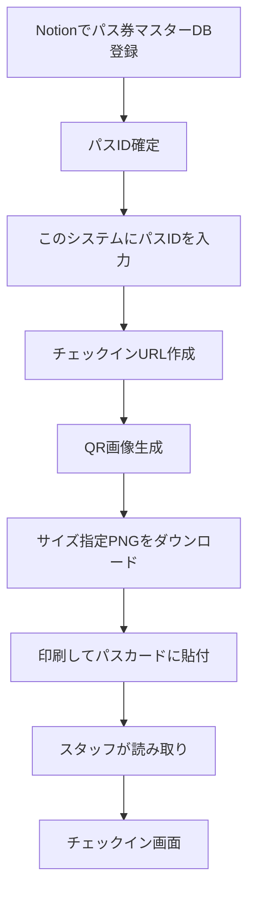

# QR作成機能の追加計画

## 方針

新しいプロジェクトは作らず、既存のExpressサーバーにQR作成用の小さな補助機能を追加します。

パス申し込み情報の入力やパス券マスターDBへの登録はNotion側で行います。このシステムでは、Notion側で決まったパスIDを手入力し、そのパスIDからチェックインURLを作り、QRコード画像としてダウンロードできるところまでを担当します。

QRの読み取り先は既存の `/checkin?pass_id=...` です。生成したPNGを印刷してパスカードに貼り、お客様が来店時に提示したカードをスタッフが読み取ると、既存のチェックイン確認画面へ進む構成にします。

対象は主に以下です。

- [server/src/index.ts](server/src/index.ts): パスID入力画面、QRプレビュー、PNGダウンロード用エンドポイントを追加
- [server/package.json](server/package.json): QR画像生成ライブラリを追加
- [server/.env.example](server/.env.example): 必要に応じて、QR内に入れる公開URL用の `PUBLIC_BASE_URL` を記載

## 業務フロー

## 実装内容

1. QR生成ライブラリを追加します。
   - 候補: `qrcode`
   - サーバー側でPNG画像を生成できるようにします。

2. パスIDからチェックインURLを作る処理を追加します。
   - 環境変数 `PUBLIC_BASE_URL` があればそれを使います。
   - 未設定時はリクエスト元から `http://localhost:3000` 相当を組み立て、ローカル開発でも動くようにします。
   - URLは `/checkin?pass_id=...` 形式にします。
   - パスIDは `encodeURIComponent` でURLに安全に埋め込みます。

3. QR作成画面を追加します。
   - 例: `GET /qr`
   - パスIDを入力するフォームを表示します。
   - サイズプリセットを選べるようにします。
   - 入力後は同じ画面でQRプレビューとダウンロードリンクを表示します。

4. QR画像エンドポイントを追加します。
   - 例: `GET /qr.png?pass_id=PASS001&size=50`
   - QRに含める内容は `https://公開URL/checkin?pass_id=PASS001` のようなチェックインURLです。
   - レスポンスは `image/png` にします。
   - `Content-Disposition: attachment` を付け、画像ファイルとしてダウンロードしやすくします。
   - ファイル名は `pass-card-qr-PASS001-50mm.png` のようにします。

5. パスカード貼付向けサイズを事前に調整します。
   - まずはパスカード貼付用として `40mm` を用意します。
   - PNGのピクセル数は300dpi相当で計算します。
   - QRコードには余白を付け、印刷時に読み取りやすくします。
   - 印刷操作自体は自動化せず、ユーザーがダウンロードしたPNGを印刷します。

6. 入力値のバリデーションを入れます。
   - `pass_id` が空なら画面上にエラーを表示します。
   - `size` は許可したプリセット以外を受け付けないようにします。
   - Notion DBへの存在確認は最初の実装では必須にしません。

7. 動作確認を行います。
   - `server` のTypeScriptビルドを通します。
   - `/qr` でフォームが表示されることを確認します。
   - `/qr.png?pass_id=...&size=...` でPNGがダウンロードできることを確認します。
   - 生成されたQRを読み取り、既存の `/checkin` に遷移することを確認します。

## 実装を小分けに進める順番

学習しながら進めるため、一気に完成させず以下の順番で進めます。各ステップの終わりで止まり、次へ進むか確認します。

1. 既存のチェックインURL `/checkin?pass_id=...` の役割を確認する
2. QR生成ライブラリを追加する
3. パスIDからチェックインURLを作る小さな関数を追加する
4. サイズプリセットとmmからpxへの変換を追加する
5. `/qr.png` でPNGを返すエンドポイントを追加する
6. `/qr` のパスID入力画面を追加する
7. QRプレビューとダウンロードリンクを画面に表示する
8. ビルドとQR読み取り確認を行う

## 旧計画から変更した点

直前の計画では、パス申し込み情報をこのシステムからNotionへ登録し、パスID発行まで行う想定でした。

今回の修正後は、その範囲を外します。Notionへの登録とパスID確定はNotion側で行い、このシステムは確定済みパスIDからQR画像を作るだけにします。

## 将来的な拡張

必要になれば、後からNotionのパス券マスターDBに存在するパスIDかどうかを確認する機能を追加できます。

また、パス発行業務や申し込み管理までシステム化する場合は、その時点で別画面や別アプリとして拡張を検討します。

# カメラチェックインアプリ 実装計画

## 画面フロー

カメラ起動 → QR読み取り → 確認画面 → ボタン押す → 完了画面 → 3秒後 → カメラ起動

## 実装ステップ

### Step 1: パッケージインストール

- 場所: プロジェクトルート (`/Users/furuu/qrchekin-system`)
- コマンド: `npm install jsqr`
- 目的: カメラ映像からQRコードを検出するライブラリ

### Step 2: Viteプロキシ設定

- ファイル: `vite.config.ts`
- 目的: ReactアプリからExpressの `/api` を呼び出せるようにする

### Step 3: サーバーにJSON API追加

- ファイル: `server/src/index.ts`
- `GET  /api/pass?pass_id=XXX` → パス情報をJSONで返す
- `POST /api/checkin` → チェックイン登録してJSONで返す

### Step 4: CSSを書く

- ファイル: `src/index.css` (上書き)
- ファイル: `src/App.css` (上書き)
- ダークテーマ、カメラアプリUI

### Step 5: Reactアプリ本体

- ファイル: `src/App.tsx` (上書き)
- 5つの状態: scanning / confirming / submitting / success / error

## 変更ファイル一覧

| ファイル              | 変更内容              |
| --------------------- | --------------------- |
| `vite.config.ts`      | プロキシ追加          |
| `server/src/index.ts` | APIエンドポイント追加 |
| `src/index.css`       | 上書き                |
| `src/App.css`         | 上書き                |
| `src/App.tsx`         | 上書き                |

## 状態管理

| 状態         | 表示内容                      |
| ------------ | ----------------------------- |
| `scanning`   | カメラ映像 + QR読み取りループ |
| `confirming` | パス情報 + チェックインボタン |
| `submitting` | 送信中スピナー                |
| `success`    | 完了 + カウントダウン(3秒)    |
| `error`      | エラーメッセージ              |
