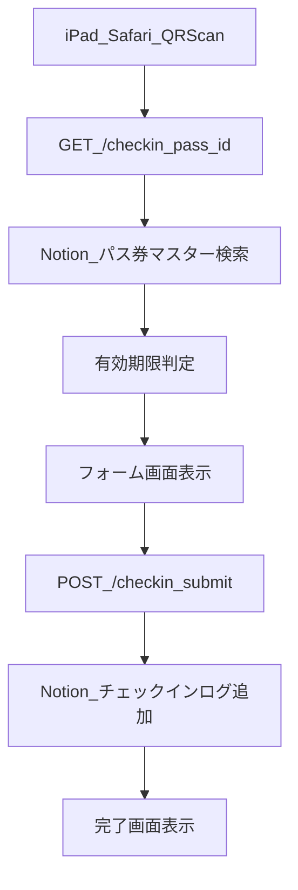

# YAMAZEN AICHI QUEST QRチェックイン実装計画

## 目的

- iPad SafariでQRを読み取り、`GET /checkin?pass_id=...` でパス情報確認＋有効期限判定を行う。
- 受付スタッフがオプション利用有無を選んで `POST /checkin/submit` 送信し、NotionのチェックインログDBへ記録する。
- まずMacでローカル検証し、同一コードをWindows常駐運用へ展開できるようにする。

## 成果物（最小構成）

- Node.js + TypeScript + Express プロジェクト一式
- 環境変数管理（`.env`）
- Notion APIクライアント層（DB検索・ログ追加）
- エンドポイント2本
  - `GET /checkin`
  - `POST /checkin/submit`
- シンプルHTMLレスポンス
  - フォーム画面（パス情報＋期限警告＋オプション選択）
  - 完了画面（チェックイン記録結果）
- 運用手順ドキュメント
  - Macローカル起動
  - iPad同一Wi-Fi検証
  - Windows移行手順

## 推奨ディレクトリ構成

- `package.json`
- `tsconfig.json`
- `.env.example`
- `src/index.ts`（Express起動・ルーティング）
- `src/notion.ts`（Notion APIラッパー）
- `src/checkin.ts`（期限判定・HTML生成ロジック）
- `src/types.ts`（型定義）
- `README.md`（セットアップ/運用）

## Notionデータ設計

### 1) パス券マスターDB

- `名前`（Title）
- `パスID`（Rich text または Text、重複禁止運用）
- `有効期限`（Date）
- （任意）`ステータス`（Select: 有効/無効）
- （任意）`備考`（Rich text）

運用ルール:

- QRには `pass_id` のみ埋め込む（個人情報を直接QRに入れない）。
- `パスID` は発行時にユニーク性を必ずチェック。

### 2) チェックインログDB

- `タイトル`（Title: 例 `YYYY-MM-DD HH:mm - パスID`）
- `パス`（Relation → パス券マスターDB）
- `チェックイン日時`（Date with time）
- `オプション利用`（Checkbox）
- （任意）`受付端末`（Select or Text）
- （任意）`結果`（Select: 成功/期限切れ/ID不正）

ビュー例:

- 今日のチェックイン（`チェックイン日時 is today`）
- 今日かつオプション利用あり（上記 + `オプション利用 = true`）

## API/画面フロー

実装方針:

- `GET /checkin`
  - `pass_id` 未指定: 400エラーHTML
  - 該当パスなし: 404エラーHTML
  - 該当あり: 期限判定付きフォームHTMLを返却
- `POST /checkin/submit`
  - サーバー側で再度 `pass_id` を検索（改ざん対策）
  - Relationでパスを紐付け、`チェックイン日時=now`、`オプション利用` を保存
  - 完了画面を返却

## セキュリティ/品質の最小要件

- `.env` で機密情報管理（`NOTION_TOKEN` をコードに直書きしない）
- 入力値検証（`pass_id` 形式・空値チェック）
- サーバー側再検証（フォーム値を信用しない）
- ログ最小化（個人情報を過剰出力しない）
- エラーハンドリング（Notion API失敗時の明確メッセージ）

## 環境変数（案）

- `PORT=3000`
- `NOTION_TOKEN=`
- `NOTION_PASS_MASTER_DB_ID=`
- `NOTION_CHECKIN_LOG_DB_ID=`
- `TZ=Asia/Tokyo`
- （任意）`BASE_URL=http://<local-ip>:3000`

## 開発〜検証フェーズ（Mac）

1. プロジェクト初期化（TypeScript/Express/Notion SDK導入）
2. `.env` 設定 + Notion統合を両DBへ共有
3. `GET /checkin` 実装・画面確認
4. `POST /checkin/submit` 実装・ログ書き込み確認
5. iPad同一Wi-FiでQR読取テスト
6. Notionビュー（今日/オプションあり）の運用確認

受け入れ基準:

- 有効期限内のパスで正常にログが1件作成される
- 期限切れが明確に警告表示される
- オプション利用の真偽がログDBに正しく反映される

## 本番移行フェーズ（Windowsローカルサーバー）

1. リポジトリをWindowsへコピー/clone
2. Node.js LTS導入、`.env` をWindows用に再作成
3. `npm ci && npm run build && npm start` で起動
4. Windowsファイアウォールでポート許可（例: 3000）
5. サーバーPC固定IP化（ルーターDHCP予約推奨）
6. QR URLをWindows固定IPへ差し替え
7. 自動起動設定（タスクスケジューラ or PM2/サービス化）

移行チェック:

- iPadからWindowsローカルIPへアクセス可能
- Notion書き込み権限とDB IDが本番用で正しい
- 再起動後も自動復帰する

## リスクと回避策

- Notion API制限/一時障害: 受付画面で再送導線と手書き代替運用を用意
- IP変更でQR無効化: 固定IP + URL管理ルール
- プロパティ名変更で連携崩れ: Notionプロパティ命名を運用固定
- 重複チェックイン: 将来拡張で「同日重複警告」ロジック追加

## 実装順序（短期）

- Step 1: Notion DB最終定義確定
- Step 2: 最小API + HTMLでE2E動作
- Step 3: iPad実機テスト
- Step 4: エラー表示・運用文書整備
- Step 5: Windows移行リハーサル

## 学習しながら進めるステップ計画（手入力ベース）

このセクションは「自動生成で一気に作る」のではなく、毎ステップで手を動かして理解するための進行表。

### Step A: プロジェクト初期化

- あなたが入力するもの
  - プロジェクト用フォルダ作成
  - `npm init -y`
- 理解ポイント
  - Node.jsプロジェクトの最小単位は `package.json`
  - 依存関係とスクリプトがここに集約される
- 完了条件
  - `package.json` が作成されている

### Step B: 依存関係の導入

- あなたが入力するもの
  - 実行時依存: `express`, `@notionhq/client`, `dotenv`
  - 開発時依存: `typescript`, `ts-node-dev`, `@types/node`, `@types/express`
- 理解ポイント
  - 実行時依存と開発時依存の違い
  - 型定義パッケージがTypeScriptに必要な理由
- 完了条件
  - `node_modules` とロックファイルが作成される

### Step C: TypeScript設定

- あなたが入力するもの
  - `tsconfig.json` の初期設定
  - `package.json` に `dev/build/start` スクリプト追加
- 理解ポイント
  - `rootDir`, `outDir`, `module`, `target` の意味
  - 開発実行（ts-node-dev）と本番実行（build後node）の違い
- 完了条件
  - `npm run build` が通る土台ができる

### Step D: 環境変数の設計

- あなたが入力するもの
  - `.env.example` と `.env`
  - `PORT`, `NOTION_TOKEN`, `NOTION_PASS_MASTER_DB_ID`, `NOTION_CHECKIN_LOG_DB_ID`
- 理解ポイント
  - 秘密情報をコードに書かない理由
  - 環境差分（Mac/Windows）を `.env` で吸収する考え方
- 完了条件
  - サーバー起動時に環境変数を正しく読める

### Step E: 最小サーバー起動

- あなたが入力するもの
  - `src/index.ts` でExpress起動
  - 疎通確認用の簡易ルート（例: `/health`）
- 理解ポイント
  - ルーティングとHTTPレスポンスの基本
  - iPadから同一Wi-Fiで到達させるための前提
- 完了条件
  - Mac上で起動し、ブラウザから応答が見える

### Step F: GET /checkin の実装

- あなたが入力するもの
  - `pass_id` 受け取りとバリデーション
  - Notionパスマスター検索
  - 有効期限判定
  - フォームHTML返却
- 理解ポイント
  - API連携の失敗系（見つからない、Notionエラー）設計
  - 期限判定をサーバー側で行う意義
- 完了条件
  - `GET /checkin?pass_id=...` で情報表示と警告表示が切り替わる

### Step G: POST /checkin/submit の実装

- あなたが入力するもの
  - `pass_id` と `option_used` の受け取り
  - サーバー側で `pass_id` 再検索
  - チェックインログDBへの追加
  - 完了画面の返却
- 理解ポイント
  - フォーム値を信用せず再検証する理由
  - Relation/Date/Checkbox をNotionへ書き込む方法
- 完了条件
  - NotionログDBに1件作成される

### Step H: iPad実機テスト

- あなたが入力するもの
  - QRに `http://<MacのIP>:3000/checkin?pass_id=...` を設定
  - スキャンから登録完了まで一連実施
- 理解ポイント
  - ローカルIP運用時の注意（IP変動、同一Wi-Fi）
  - 運用手順を短く標準化する重要性
- 完了条件
  - 受付想定フローが現場動線で問題なく回る

### Step I: Windows移行リハーサル準備

- あなたが入力するもの
  - Windowsでのセットアップ手順書
  - 起動コマンドと自動起動方針（タスクスケジューラ等）
  - 固定IP化チェック項目
- 理解ポイント
  - 「動くコード」だけでなく「止まらない運用」を設計する視点
- 完了条件
  - Windowsで再現可能な手順が文書化されている

### 進め方のルール（伴走モード）

- 1ステップずつ進め、各ステップで「入力 → 実行 → 結果確認 → 解説」を必ず行う
- エラーが出たら先に原因を言語化してから修正する
- 各ステップ完了時に「なぜこの設定/実装が必要か」を1-2行で振り返る
